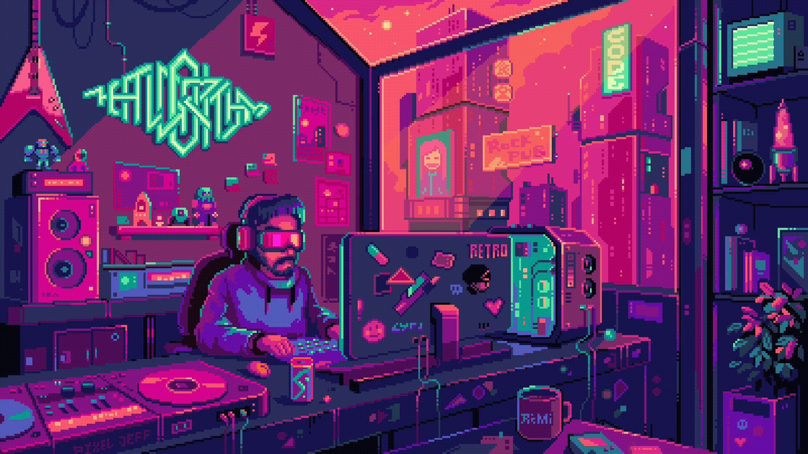

# Eduardo Rodrigues 👨🏽‍💻

  
  Credit: https://www.behance.net/pixeljeff

## 👋 Introduction
Hello everyone, I'm Eduardo Rodrigues. I am a Front-end Web and Mobile developer from Brazil who loves tech and innovation. I work with **React**, **React Native**, **JavaScript** and **TypeScript**. Contact me if you have any doubts, I'll be glad to help if I can!

## 🔨 Tools

   

    
  
  
  
      

 

## 🛠️ My Projects

  
  

      

    

## Stats

  

#Gostos
#Github Stats

<!--
**eduardovrs/eduardovrs** is a ✨ _special_ ✨ repository because its `README.md` (this file) appears on your GitHub profile.

Here are some ideas to get you started:

- 🔭 I’m currently working on ...
- 🌱 I’m currently learning ...
- 👯 I’m looking to collaborate on ...
- 🤔 I’m looking for help with ...
- 💬 Ask me about ...
- 📫 How to reach me: ...
- 😄 Pronouns: ...
- ⚡ Fun fact: ...
-->
